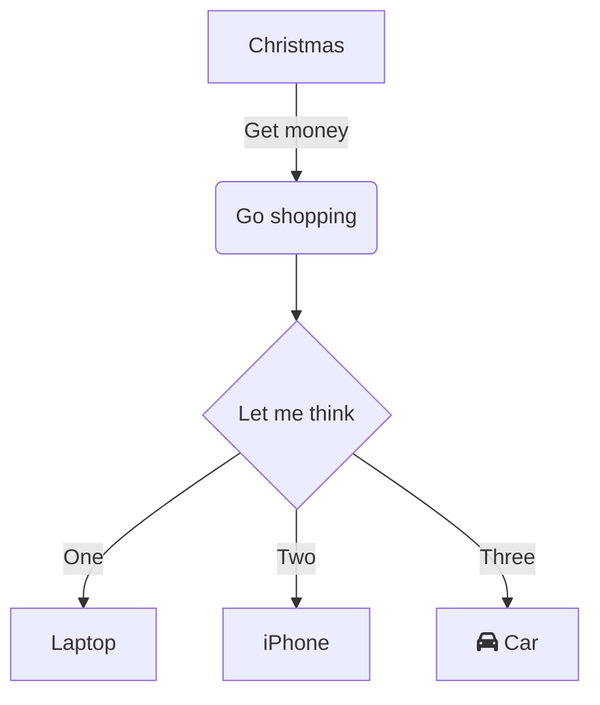

# 見出し1
## 見出し2
### 見出し3
#### 見出し4
##### 見出し5
###### 見出し6

本文テキスト 段落1
段落1つづき

本文テキスト 段落2

*italic 英数字以外は斜体にならない*

**強調**

***strong&italic あいう***

~~打ち消し~~

文字位置<sub>下付き</sub><sup>上付き</sup>

> 引用0

> 引用1
> 引用1
>
> 引用3
>> 引用4

- 箇条書き
- 箇条書き
    - 箇条書き
        - 箇条書き
- 箇条書き
- 箇条書き

1. 数字付き箇条書き 自動採番
1. 数字付き箇条書き
    1. 数字付き箇条書き
    1. 数字付き箇条書き
        1. 数字付き箇条書き
        1. 数字付き箇条書き
1. 数字付き箇条書き
1. 数字付き箇条書き

- [x] タスクリスト 完了
- [ ] タスクリスト 未了

abc`インラインコード`あいう`inline code`

```javascript
// コードブロック
console.log('コードブロック')
Array.from(document.getElementsByClassName('test')).map(v=>v.innerText)
```

mermaid (オンラインモードのみ)



表
|ID|name|
|-|-|
|0|example|
|1|test|
|2|dummy|
|3|mock|
|4|fake|
|5|stub|

表 (フォーマット)
|左揃え|中央揃え|右揃え|
|:-|:-:|-:|
|1|2|3|
|4|5|6|

リンク

[Google](https://google.com)

[ドキュメント内アンカーリンク(見出しに飛ぶ)](#見出し1)

[参照リンク][link]

[link]: https://example.com "リンクを定義できる"

画像 (Base64形式で添付すると1ファイルにできる)


![参照形式][bimg]

[bimg]: data:image/png;base64,iVBORw0KGgoAAAANSUhEUgAAACAAAAAQCAYAAAB3AH1ZAAAAAXNSR0IArs4c6QAAAARnQU1BAACxjwv8YQUAAAAJcEhZcwAACxMAAAsTAQCanBgAAACvSURBVEhLxZOBCsQgDEPr/v+fvQVWLlcb6xDOB2PatTGd2sys388xrud9jOMGhi3o/d2OtAaJbx3mUcNzMpbOAIsrZgaAqpUGMhEmClb5IDMxnIEoxEXVov4d72ycUR5CXkR1GeOYe4zHGaUBdj/rxFEdq9rtazjrnlF/YXsLVMcRlYPojyoWWREEnBvrlNlIauANbIBB3GNxzEgDmVsm5mHOY6fSGQz8m+1bsIfZBwl3cRGp5pypAAAAAElFTkSuQmCC "base64参照形式"

外部画像 (オンラインモードのみ)


![参照形式でも可能][img]

[img]: https://upload.wikimedia.org/wikipedia/commons/thumb/f/fd/Caribou.jpg/320px-Caribou.jpg "参照形式"

水平線
***
水平線
___

水平線 (見出し1相当)
===

水平線 (見出し2相当)
---
